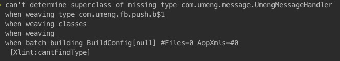

[xposed]:https://github.com/rovo89/Xposed
[dexposed]:https://github.com/alibaba/dexposed
[Hugo]:https://github.com/JakeWharton/hugo
[gradle-android-aspectj-plugin]:https://github.com/uPhyca/gradle-android-aspectj-plugin
[问题反馈]:https://github.com/HujiangTechnology/gradle_plugin_android_aspectjx/issues

aspectjx
==================================

 一个在Android中应用Aspectj的Gradle插件。支持切AAR, JAR， 支持现在Android上最火的Kotlin。 
 
 
### 为什么会有aspectjx

 开发该项目的原因是基于还没有发现目前的开源库中比较好的AOP框架或者工具，虽然[xposed]，[dexposed]非常强大，但由于Android的碎片化比较严重，兼容问题永远是一座无法逾越的大山。而且发现的AspectJ相关插件都不支持AAR或者JAR切入的，对于目前在Android圈很火爆的Kotlin更加无能为力。
 
 该项目的设计参考了大神**JakeWharton**的[Hugo]项目及**uPhyca**的[gradle-android-aspectj-plugin]项目的设计思想，并在它们的基础上扩展支持AAR, JAR及Kotlin的应用。在此感谢JakeWharton和uPhyca.[跪拜]


### 使用

> **aspectjx**是基于 gradle android插件1.5及以上版本设计的，如果你还在用1.3或者更低版本，请把版本升上去。

> **aspectjx**是使用在application module的插件, 虽然用在library module上也不会出错,但是不生效。

* 路径依赖

```
 dependencies {
        classpath 'com.hujiang.aspectjx:gradle-android-plugin-aspectjx:1.0.8'
        }
```
* 或者使用product目录下的jar包，在你的项目根目录下新建目录plugins，把product/gradle-android-plugin-aspectjx-1.0.8.jar拷贝到plugins，依赖jar包

```
dependencies {
        classpath fileTree(dir:'plugins', include:['*.jar'])
        //注意不能少了aspectjtools的依赖，否则会报错
        classpath 'org.aspectj:aspectjtools:1.8.+'
        }
```

`注意`: `compile 'org.aspectj:aspectjrt:1.8.+'` 必须添加到包含有AspectJ代码的module. [可以参考Demo](https://github.com/HujiangTechnology/AspectJX-Demo/blob/master/library/build.gradle)

* 在app项目的build.gradle里应用插件

```
apply plugin: 'android-aspectjx'
//或者这样也可以
apply plugin: 'com.hujiang.android-aspectjx'
```

* aspectjx配置

aspectjx默认会遍历项目编译后所有的.class文件和依赖的第三方库去查找符合织入条件的切点，为了提升编译效率，可以加入过滤条件指定遍历某些库或者不遍历某些库。

`includeJarFilter`和`excludeJarFilter`可以支持`groupId`过滤，`artifactId`过滤，或者依赖路径匹配过滤

```
aspectjx {
	//织入遍历符合条件的库
	includeJarFilter 'universal-image-loader', 'AspectJX-Demo/library'
	//排除包含‘universal-image-loader’的库
	excludeJarFilter 'universal-image-loader'
}
```

. 忽略groupId为`org.apache.httpcomponents`的库

```
aspectjx {
	excludeJarFilter 'org.apache.httpcomponents'
}
```
. 忽略artifactId为`gson`的库

```
	aspectjx {
		excludeJarFilter 'gson'
	}
```

. 忽略jar `alisdk-tlog-1.jar`

```
	aspectjx {
		excludeJarFilter 'alisdk-tlog-1'
	}
```


* 忽略所有依赖的库

```
aspectjx {
	excludeJarFilter '.jar'
}
```

### 注意

* 由于IntelliJ现在并没有提供AspectJ相关的工具和插件，所以，在Android Studio,IDEA上不支持*.aj文件的编译。目前仅支持AspectJ annotation的方式。所以`aspectjx`也只支持annotation的方式，具体可以参考[支持kotlin代码织入的AspectJ Demo](https://github.com/HujiangTechnology/AspectJ-Demo)
* Android Studio的Instant Run功能有时会对你的编译有影响，当出现这种情况时，关闭Instant Run功能，[参考Issue](https://github.com/HujiangTechnology/gradle_plugin_android_aspectjx/issues/2)
* aspectj代码编译时会报一些如下的错，找到对应的库，把这个库过滤掉就可以了。



* 需要在AOP代码进行hook的类及方法名不能被混淆,需要在混淆配置里keep住, 比如:

```
package com.hujiang.test;

public class A {
    public boolean funcA(String args) {
        ....
    }
}

//如果你在AOP代码里对A#funcA(String)进行hook, 那么在混淆配置文件里加上这样的配置

-keep class com.hujiang.test.A {*;}

```


### [问题反馈](https://github.com/HujiangTechnology/gradle_plugin_android_aspectjx/issues)


### [版本变更日志](CHANGELOG.md)


### 参考


* [支持kotlin代码织入的AspectJ Demo](https://github.com/HujiangTechnology/AspectJ-Demo)
* [用aspectjx实现的简单、方便、省事的Android M动态权限配置框架](https://github.com/firefly1126/android_permission_aspectjx)


* [AspectJ官网](https://eclipse.org/aspectj/)

* [AspectJ Programming Guide](https://eclipse.org/aspectj/doc/released/progguide/index.html)

* [AspectJ Development Environment Guide](https://eclipse.org/aspectj/doc/released/devguide/index.html)

* [AspectJ NoteBook](https://eclipse.org/aspectj/doc/released/adk15notebook/index.html)

### 联系方式


email:xiaoming1109@gmail.com

QQ:541136835

微信:13386016339


### License


    Copyright 2016 firefly1126, Inc.

    Licensed under the Apache License, Version 2.0 (the "License");
    you may not use this file except in compliance with the License.
    You may obtain a copy of the License at

       http://www.apache.org/licenses/LICENSE-2.0

    Unless required by applicable law or agreed to in writing, software
    distributed under the License is distributed on an "AS IS" BASIS,
    WITHOUT WARRANTIES OR CONDITIONS OF ANY KIND, either express or implied.
    See the License for the specific language governing permissions and
    limitations under the License.gradle_plugin_android_aspectjx
